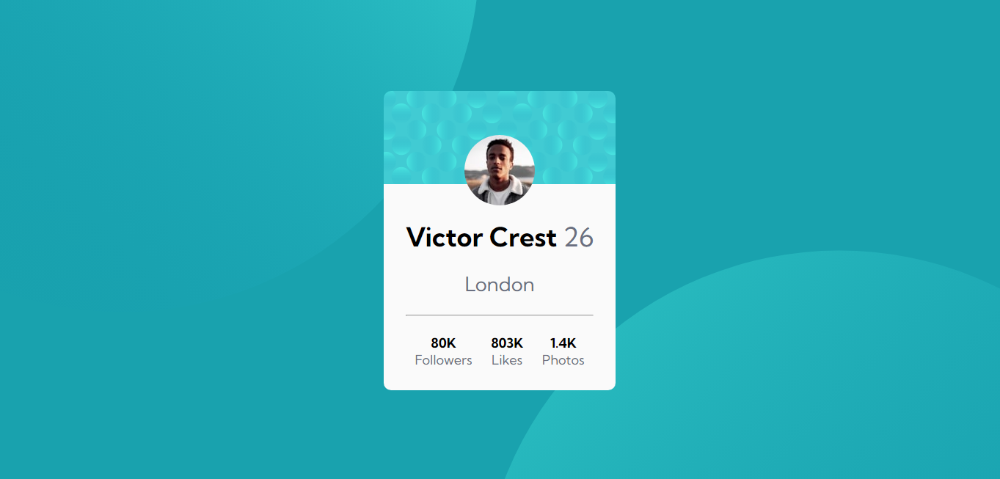
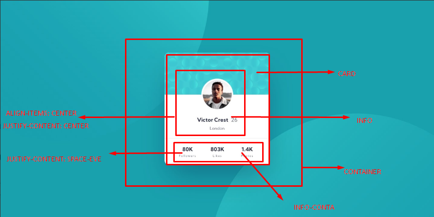
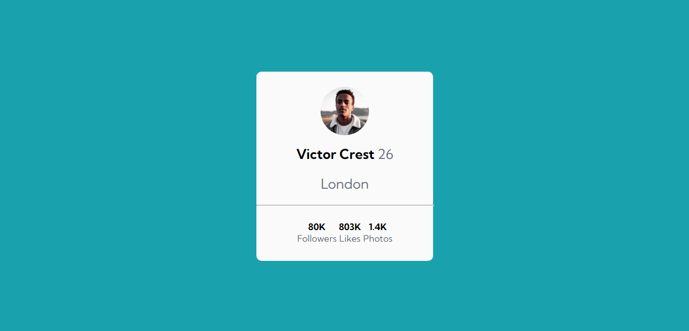
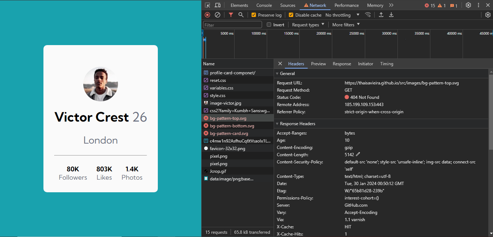

# Frontend Mentor - Profile card component solution

This is my solution to the [Profile card component challenge on Frontend Mentor](https://www.frontendmentor.io/challenges/profile-card-component-cfArpWshJ). I'm using Frontend Mentor challenges to help me improve my coding skills by building realistic projects.

## Table of contents

- [Overview](#overview)
  - [The challenge](#the-challenge)
  - [Screenshot](#screenshot)
  - [Links](#links)
- [My process](#my-process)
  - [Built with](#built-with)
  - [What I learned](#what-i-learned)
- [Author](#author)

## Overview

### The challenge

The main goal of this challenge is to build out the project to the designs provided by practicing flexbox skills.

### Screenshot

## My process

To build this project without Sketch and Figma design file access, I used the LightShot application to take screenshots and analyze the desired content in parts. You can check this analysis in the image below:

This was the first solution's version:

In this solution is possible to see any background image in body or in the personal informations section. So as we can see a spacing flexbox issue in account information, where the LI elements are closer than the original design.

Now, let's have a look in the second's solution:

 That solution is only possible thanks to Frontend Mentor community, who answered my doubts and helped me to build a better code. A special thanks to [Hugo Sanchez](https://www.frontendmentor.io/profile/HunigoleSan) and [Daniel](https://www.frontendmentor.io/profile/danielmrz-dev).

 The screenshot comes directly from my local server, when I uploaded this new version to GitHub, I find the following issue on GitHub Pages:

All of my bg-pattern-top.svg, bg-pattern-bottom.svg, and bg-pattern-card.svg images have the 404 Not Found status code,  just as if they were missing files.

### Links

- Solution URL: [GitHub Repository](https://github.com/thaisavieira/profile-card-componet)
- Live Site URL: [GitHub Pages](https://thaisavieira.github.io/profile-card-componet/)

### Built with

- Semantic HTML5 markup;
- CSS custom properties;
- CSS variables;
- Flexbox.

### What I learned

It was a relevant project for reinforcing semantic HTML skills, styling and my first flexbox practice where I was able to reinforce the content learned in the classes and activities of the DevQuest course. Building the first project alone is a good experience as it tested what I have really learned and what topics I need to revisit.

### Useful resources

- [CSS-Tricks](https://css-tricks.com/snippets/css/a-guide-to-flexbox/) - This helped me for being a visual resource and bring some pratical examples of application. I really liked this pattern and will use it going forward.
- [My own class notes (pt-BR)](https://www.notion.so/CSS-Avan-ado-Flexbox-046260bf28e64e89a553623ba180ea03?pvs=4) -These notes were made in class, during explanations of concepts and practical examples.

## Author

- GitHub - [Thaísa Vieira](https://github.com/thaisavieira)
- Frontend Mentor - [@thaisavieira](https://www.frontendmentor.io/profile/thaisavieira)
- Dev.to - [@thaisavieira](https://dev.to/thaisavieira)
