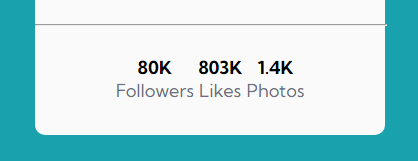

# Frontend Mentor - Profile card component solution

This is my solution to the [Profile card component challenge on Frontend Mentor](https://www.frontendmentor.io/challenges/profile-card-component-cfArpWshJ). I'm using Frontend Mentor challenges to help me improve my coding skills by building realistic projects.

## Table of contents

- [Overview](#overview)
  - [The challenge](#the-challenge)
  - [Screenshot](#screenshot)
  - [Links](#links)
- [My process](#my-process)
  - [Built with](#built-with)
  - [What I learned](#what-i-learned)
- [Author](#author)

## Overview

### The challenge

The main goal of this challenge is to build out the project to the designs provided practicing flexbox skills.

### Screenshot


### Links

- Solution URL: [Add solution URL here](https://your-solution-url.com)
- Live Site URL: [Add live site URL here](https://your-live-site-url.com)

## My process

To build this project without Sketch and Figma design file access, I used the LightShot application to take screenshots and analyze the desired content in parts. You can check this analysis in the image below:

Although I reached a similar result, something that bothers me is the little spacing between the elements of the .account-info class:

What did I do:
What I have already tested is that the justify-content property has the same result when I apply the space-around and space-evenly values, while space-between the element in question sticks to the corner. When I remove the padding:30px, the result is that the element rises by 30px and does not result in changes to the sides.

Follow the code below

```CSS
.card .account-info li{
    display: inline-block;
}

.card .account-info{
    display: flex;
    justify-content: space-evenly;
    text-align: center;
    padding: 30px;
}
```

If possible, I would like tips on how I can solve this problem to make the solution more similar to the proposed design.

### Built with

- Semantic HTML5 markup;
- CSS custom properties;
- CSS variables;
- Flexbox.

### What I learned

It was a relevant project for reinforcing semantic HTML skills, styling and my first flexbox practice where I was able to reinforce the content learned in the classes and activities of the DevQuest course. Building the first project alone is a good experience as it tested what I have really learned and what topics I need to revisit.

### Useful resources

- [CSS-Tricks](https://css-tricks.com/snippets/css/a-guide-to-flexbox/) - This helped me for being a visual resource and bring some pratical examples of application. I really liked this pattern and will use it going forward.
- [My own class notes (pt-BR)](https://www.notion.so/CSS-Avan-ado-Flexbox-046260bf28e64e89a553623ba180ea03?pvs=4) -These notes were made in class, during explanations of concepts and practical examples.

## Author

- GitHub - [Thaísa Vieira](https://github.com/thaisavieira)
- Frontend Mentor - [@thaisavieira](https://www.frontendmentor.io/profile/thaisavieira)
- Dev.to - [@thaisavieira](https://dev.to/thaisavieira)
